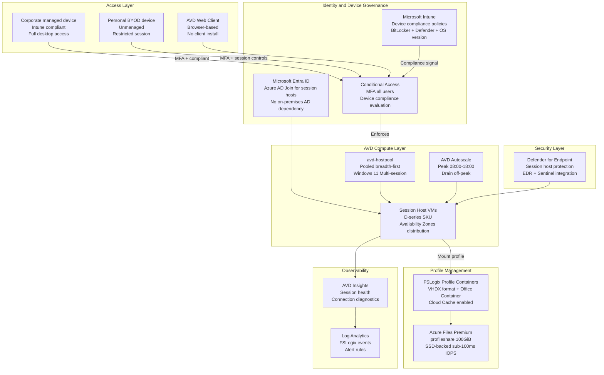

# Azure Virtual Desktop for Hybrid Workforce

[](https://sergeksfumey.com/projects/azure-virtual-desktop-(avd)-for-hybrid-workforce)
[]()
[]()
[]()

> **Design Study** -- Independent architecture exercise for hybrid workforce environments. Not associated with a production deployment.

Cloud-native EUC platform on Azure Virtual Desktop -- pooled Windows 11 multi-session host pools, FSLogix profile containers on Azure Files Premium, differentiated Conditional Access for managed and BYOD devices, AVD Autoscale cost optimisation, and Terraform-automated infrastructure provisioning.

---

## Architecture Diagram



---

## BYOD vs Managed Device Access Model

| Access Scenario | Device | CA Policy | Session Restrictions |
|---|---|---|---|
| Corporate managed device | Intune compliant | MFA + compliant device | Full desktop access |
| Hybrid AAD joined device | Domain-joined + compliant | MFA + hybrid joined | Full desktop access |
| Personal BYOD device | Unmanaged | MFA + session controls | Clipboard, printing, drive redirection disabled |
| Unmanaged high-risk sign-in | Any | Block | No session granted |

---

## AVD Autoscale Configuration

| Parameter | Configuration | Purpose |
|---|---|---|
| Peak hours | 08:00-18:00 UTC | Maintain capacity for peak demand |
| Off-peak | Evenings and weekends | Drain and deallocate idle hosts |
| Minimum hosts | 2 always-on | Immediate availability for first users |
| Scale-out threshold | 80% session capacity | Start new hosts before exhaustion |
| Scale-in threshold | 20% session utilisation | Drain underutilised hosts |

Autoscale reduces AVD compute costs 40-60% during off-peak hours vs always-on capacity sizing.

---

## FSLogix Profile Architecture

| Component | Configuration | Rationale |
|---|---|---|
| Profile Container | VHDX format, dynamic sizing | Full profile persistence across all session hosts |
| Office Container | Separate VHDX | Isolates large Office cache from profile container |
| Container storage | Azure Files Premium (SSD) | Sub-100ms IOPS -- critical for logon performance |
| Concurrent sessions | Read-write primary, read-only secondary | Simultaneous multi-session access |
| Cloud Cache | Enabled | Local cache reducing Azure Files dependency |

Azure Files Premium over Standard: Standard HDD latency creates measurable logon delays. Premium SSD delivers consistent sub-100ms IOPS required by FSLogix. Cost premium justified by direct user experience impact.

---

## Executive Summary

Architected a cloud-native EUC platform on Azure Virtual Desktop integrating pooled and personal host pools, Entra ID Conditional Access, Microsoft Intune device compliance, FSLogix profile containers on Azure Files Premium, AVD Autoscale, Defender for Endpoint session protection, and Terraform-based infrastructure automation -- delivering persistent user experiences, centralised governance, and Zero Trust-aligned security.

The design demonstrates how legacy VPN and on-premises VDI can be modernised through cloud-native desktop delivery -- improving scalability, security governance, and user experience while reducing infrastructure operational overhead.

---

## Architecture Principles

- Identity-first access -- authentication and device state evaluated at every session initiation
- Cloud-native desktop delivery -- no on-premises VDI infrastructure dependencies
- Persistent user experience -- profile state independent of which session host serves the connection
- Elastic scalability -- session host capacity adapts to demand through Autoscale
- Device-aware security -- managed and BYOD devices receive differentiated controls
- Separation of control and compute planes -- AVD control plane (Microsoft-managed), session hosts (customer-managed)
- Infrastructure automation -- all provisioning as Terraform code, not manual portal configuration
- Centralised observability -- session performance, profile health, security events in Azure Monitor

---

## Design Decisions

### ADR-001 -- AVD over Traditional On-Premises VDI
**Decision:** Cloud-native AVD replacing on-premises VDI
**Rationale:** On-premises VDI requires hardware investment, lacks elastic scalability, and creates operational overhead. AVD eliminates the control plane (Microsoft-managed gateway, broker, diagnostics). Customers manage session host VMs only.
**Trade-off:** Cloud egress and licensing costs. Offset by Autoscale compute savings and eliminated VDI infrastructure costs.

### ADR-002 -- Pooled Multi-Session for Standard Users
**Decision:** Pooled breadth-first host pool for standard knowledge workers
**Rationale:** Personal pools assign dedicated VMs per user -- eliminating sharing efficiency. Pooled multi-session significantly improves infrastructure utilisation and reduces per-user compute cost.
**Trade-off:** Session host contention during peaks. Mitigated through Autoscale and right-sizing.

### ADR-003 -- FSLogix over Traditional Roaming Profiles
**Decision:** FSLogix VHDX profile containers replacing roaming profiles
**Rationale:** Roaming profiles copy entire profile at logon/logoff -- long logon times, network congestion, corruption risk. FSLogix mounts the profile as a VHD -- no copy operation, always local to session.
**Trade-off:** Container compaction required -- VHDX grows dynamically, does not auto-shrink. Automated weekly compaction jobs required.

### ADR-004 -- Azure Files Premium for FSLogix Storage
**Decision:** Azure Files Premium (SSD) over Standard (HDD) for profile containers
**Rationale:** FSLogix performs numerous small I/O operations during profile mount. Standard HDD latency creates measurable logon delays at scale. Premium delivers consistent sub-100ms IOPS.
**Trade-off:** Higher cost than Standard. Transaction costs at scale (500+ users) require modelling. Azure NetApp Files may be more cost-effective at very large scale.

### ADR-005 -- Azure AD Join + Intune over Traditional Domain Join
**Decision:** Azure AD Join with Intune management for session hosts
**Rationale:** AD DS domain join requires on-premises DC line-of-sight -- creating hybrid connectivity dependencies. Azure AD Join eliminates this. Aligns with Zero Trust cloud-native principles.
**Trade-off:** Some legacy applications may require Kerberos/NTLM from on-premises AD. Hybrid join or Entra Domain Services may be required for legacy app scenarios.

### ADR-006 -- Differentiated CA for BYOD
**Decision:** Session-level restrictions for unmanaged BYOD vs full access for managed devices
**Rationale:** Blanket BYOD blocking creates productivity barriers. Unrestricted BYOD creates data exfiltration risk. Differentiated CA applies session controls (clipboard, printing, drive redirection disabled) for BYOD while preserving productive access.
**Trade-off:** Session restrictions create UX friction for BYOD users. Policy design must balance security against realistic workflow requirements.

---

## Technologies

| Category | Technologies |
|---|---|
| Virtual Desktop Platform | Azure Virtual Desktop (AVD) |
| Identity and Access | Microsoft Entra ID · Conditional Access · MFA |
| Device Management | Microsoft Intune |
| Profile Management | FSLogix · Azure Files Premium |
| Security | Microsoft Defender for Endpoint · Azure RBAC |
| Autoscaling | AVD Autoscale |
| Networking | Azure VNet · NSGs · Private Endpoints |
| Monitoring | Azure Monitor · Log Analytics · AVD Insights |
| Infrastructure Automation | Terraform · PowerShell · Azure CLI |
| Image Management | Azure Compute Gallery |

---

## Repository Structure
```
azure-virtual-desktop/
├── terraform/
│   ├── modules/
│   │   ├── avd-host-pool/
│   │   ├── avd-session-hosts/
│   │   └── fslogix-storage/
│   └── environments/
│       └── prod/
├── scripts/
│   ├── Configure-FSLogix.ps1
│   ├── Configure-AVDAutoscale.ps1
│   └── Invoke-ProfileCompaction.ps1
├── runbooks/
│   └── Get-AVDSessionReport.ps1
├── kql/
│   ├── avd-session-health.kql
│   └── fslogix-profile-events.kql
├── docs/
│   ├── architecture.md
│   ├── fslogix-operations.md
│   └── byod-access-guide.md
└── pipelines/
    └── azure-pipelines.yml
```
---

## Future Evolution

- AVD Autoscale with predictive analytics for proactive capacity management
- GPU-enabled session hosts for CAD, media processing, AI-assisted workloads
- MSIX App Attach for application virtualisation without golden image rebuild cycles
- Cross-region secondary host pools for geographic failover
- Zero Trust network segmentation restricting session host outbound to required resources
- AI-assisted session performance monitoring for proactive issue detection

---

*Part of the [sergeksfumey](https://github.com/sergeksfumey) infrastructure architecture portfolio · [sergeksfumey.com](https://sergeksfumey.com)*
